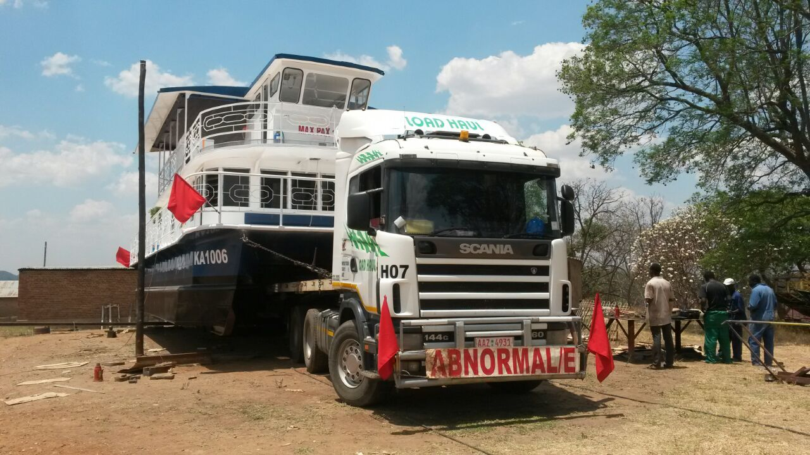

  
  

# Transport service excellence exceptional customer service Innovative Solutions

Keeping our customers satisfied

## About **Us**

#### The story of who we are

Founded in 2008 and focused on providing cross-border transport across Zimbabwe, Zambia, and South Africa. We are a BEE Level 6 certified firm, able to offer our clients various options with regards to collection and delivery destinations. We have a sister company in Zimbabwe operating three triaxles.

We have built up a wide customer base with our well-trained, well-presented and well-mannered drivers. We operate a fully equipped workshop with highly trained staff in Zimbabwe en-route for both companies with a 24 hours call out facility.

We are a small business which manages to do our best to provide a personal and professional service.

## GARIAN AGRI SERVICES PVT LTD
### T/A PRIMTRACK TRADING

OUR SISTER COMPANY OPERATING IN ZIMBABWE

## PRODUCTS & **SERVICES** 

We use some of the world’s most cutting-edge innovations to promote package safety, increase distribution e�ciency, advance sustainability, lessen environmental impact and minimize supply chain waste. We cover a wide range of product transportation including but not limited to the following:
1. Fertilizers
2. Steel Loads
3. Bulk and Breakbulk Commodities
4. Mining and Agricultural Equipment
5. Various Minerals and Commodities
7. Stockfeed Commodities

## OUR **CLIENTS**

MOVING VALUABLES ACROSS THE SOUTHERN AFRICAN REGION

  

## *LEAVE US A MESSAGE*

<form action="#">
                <input type="text" placeholder="Name :" style="background:transparent; border:none ">  
                <input type="text" placeholder="Email Address :" style="background:transparent; border:none">   
                <input type="text" placeholder="Message :" style="background:transparent; border:none ">  
                <a href="#" title="submit" style="darkorange;font-size:15px">Submit</a>
</form>

***

## CONTACT **US**

25 Main Road, Anderbolt, Boksburg North, Johannesburg, South Africa

<a href="mailto:loadhaultrucking.com" title="address" >info@loadhaultrucking.com</a>

Mobile: +263 77 272 0112

Work: +263 67214 2631/2

***

## FOLLOW **US**
*<a href="https://tanyaradzwa20.github.io/MarkDown2/#myself" title="Title" style="color:darkorange;">Facebook</a>*
*<a href="https://tanyaradzwa20.github.io/MarkDown2/#myself" title="Title" style="color:darkorange;">Instagram</a>*
*<a href="https://tanyaradzwa20.github.io/MarkDown2/#myself" title="Title" style="color:darkorange;">Linked In</a>*
  
